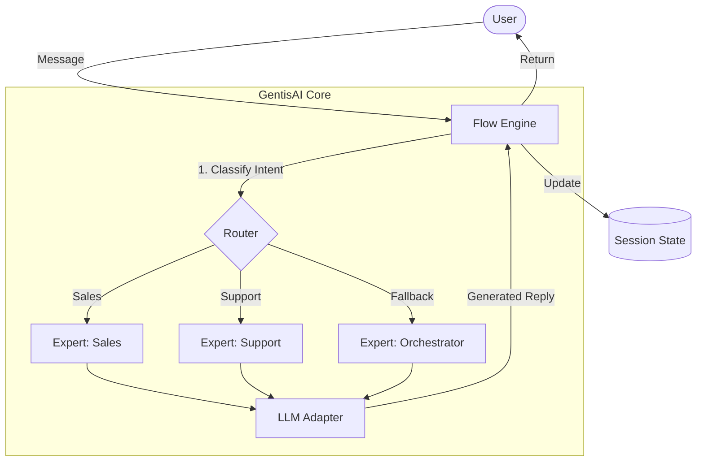

# 🚀 GentisAI


### *The lightweight framework for real-time AI agents.*

Build multi-expert systems with precise routing, zero overhead, and **6× less token usage than major competitors**.

---

## 🌟 Why GentisAI?

Traditional agent frameworks (LangChain, CrewAI, AutoGen…) are created for **complex, autonomous, long-running tasks**.
They introduce:

* Heavy orchestration layers
* Hidden “manager” reasoning loops
* Massive prompts
* Slow response times
* High token usage

**GentisAI is built for a different purpose:**

👉 **Create fast, deterministic, conversational AI agents that feel real-time.**

---

## 🔥 The Gentis Advantage

### ⚡ **6× More Efficient**

Our architecture uses **~83% fewer tokens per turn** than CrewAI in benchmarks.

### 🎯 **Precise Expert Routing**

A tiny, dedicated router sends each message to the correct expert
— fast, deterministic, and with no “agent arguing with itself.”

### 🪶 **Minimalist API**

Experts are simple Python classes.
Router is a single object.
Flow is one line.

### 🔍 **Fully Transparent**

No black-box loops.
You control the routing logic, prompts, and state.

### 🛠️ **Production-Ready Structure**

Clean separation of concerns:

* Experts
* Router
* Flow
* Memory
* LLM Adapters

---

# 📊 Benchmark Highlights
### Multi-Context Vs Multi-Agents

GentisAI was compared against a leading framework in a **real 3-turn conversational scenario** requiring expert handoffs.

**Model:** Gemini 2.5 Flash (Dec 2025)

| Metric               | **GentisAI** | **CrewAI** | Difference           |
| -------------------- | ----------------- | ---------- | -------------------- |
| **Total Latency**    | **12.6 s**        | 30.0 s     | **2.4× Faster**      |
| **Total Tokens**     | **3,077**         | 18,521     | **~6× Fewer Tokens** |
| **Avg Latency/Turn** | **4.2 s**         | 10.0 s     | —                    |
| **Avg Tokens/Turn**  | **1,025**         | 6,173      | **~83% Cheaper**     |

> **Why the difference?**
> CrewAI generates **~15,000 extra "manager" tokens** per session to decide which expert should answer.
> GentisAI routes instantly—no wasted reasoning loops.

** **You can find the outputs and code of each framework in** `comparison/` **folder.**

---

## 📈 Benchmark Visualization (Bar Plot)

👉 **(Bar plot will be inserted here after generation)**

```

```

*The image will display latency and token usage differences between GentisAI and CrewAI.*

---

# 💡 Philosophy: Pragmatic Routing & Naming

The name *GentisAI* is inspired by the Latin root $\mathbf{agentis}$ (the genitive form of $\mathbf{agens}$), which means “of the agent” or “the one doing.”

### **Simple things should be simple. Complex things should stay possible.**

We achieve this latency and efficiency trade-off by focusing on three core principles:

### ✔ **Context-Aware Routing**

A tiny LLM classification call over a **recent sliding window**, not the entire history.

### ✔ **No Hidden Reasoning Loops**

Experts respond immediately.
An Orchestrator expert is used only as a fallback.

### ✔ **Sliding-Window Optimization**

Keeps token cost low while preserving high conversational accuracy.

**The result:**

This foundation reflects our core belief: that high-performance AI systems must be built by focusing on the precise actions of the agent—optimizing every step to ensure **speed**, **efficiency (low cost)**, and **deterministic routing**.

---

# 🛠️ How It Works



---

# 📦 Installation

```bash
pip install gentis-ai
```

---

# ⚡ Quick Start (No API Key Required)

The included **MockLLM** lets you prototype routing instantly, **offline**.

```python
from gentis_ai import Expert, Router, Flow
from gentis_ai.llm import MockLLM

# 1. Define a Mock LLM for testing
llm = MockLLM(
    routing_rules={
        "help": "support_agent",
        "buy": "sales_agent"
    },
    responses={
        "help": "I can certainly help you with your technical issue.",
        "buy": "Great! Let's get you set up with a new plan."
    },
    default_response="I'm not sure how to route that request."
)

# 2. Define your Experts
support = Expert(name="support_agent", description="Handles technical support queries.")
sales   = Expert(name="sales_agent",   description="Handles sales and upgrades.")

# 3. Initialize Router and Flow
router = Router(experts=[support, sales], llm=llm)
flow   = Flow(router=router, llm=llm)

# 4. Run a turn
response = flow.process_turn("I need help with an error.")

print(response.agent_name)  # support_agent
print(response.content)      # I can certainly help you...
```

---

# 🌐 Real LLM Usage (Gemini, etc.)

Switching from mock mode to a real model is just one line:

```python
import os
from gentis_ai.llm import GeminiLLM

llm = GeminiLLM(
    model_name="gemini-2.5-flash-lite",
    api_key=os.getenv("GOOGLE_API_KEY")
)

# Everything else stays the same
```

---

# 📘 Documentation & Examples

* `examples/simple_bot.py` — A basic two-expert system
* `examples/advanced_flow.py` — Multi-turn flows and expert handoffs
* `comparison/README_comparison.md` — Full benchmark logs

---

# 🤝 Contributing

We welcome contributions!
Pull requests, issues, and feature ideas are all appreciated.
See **CONTRIBUTING.md**.

---

# 📜 License

MIT License — see `LICENSE`.

---