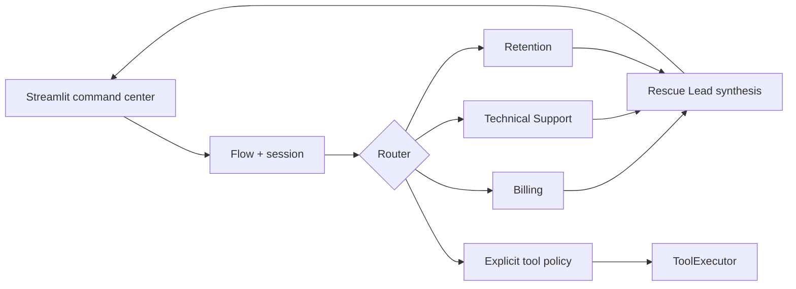
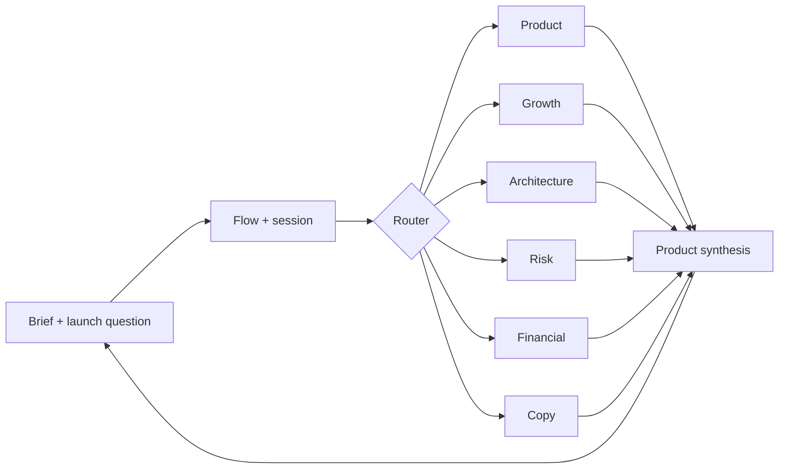

# GentisAI 0.2.1 Launch Kit

| POC | Audience | Problem | GentisAI proof | Visual hook | Video fit | Complexity |
|---|---|---|---|---|---|---|
| Customer Rescue Command Center | CX engineers | Mixed customer issues | Hybrid routing, tools, sessions, streaming | Experts and tool events activate live | Complex value is visible instantly | Medium |
| AI Product Launch War Room | Founders and product teams | Focused launch advice | Contextual routing, parallel experts, synthesis | Each prompt activates a different team | Proves routing is not broadcast | Medium |

## Customer Rescue Command Center

Hook: one customer message assembles the exact rescue team, runs safe fictional tools, and streams a coordinated answer. Billing, Technical Support, Sales, Account Security, Retention, and the Rescue Lead are real `Expert` definitions. The validated route authorizes `check_invoice`, `create_support_ticket`, or `lookup_account`; `Flow` executes and reports them.



Project: `demos/customer_rescue/` contains `app.py`, `gentis_setup.py`, `tools.py`, `requirements.txt`, `.env.example`, `README.md`, and tests.

Scenarios:

1. Input: `Please check invoice INV-2048.` Expected: Billing, `check_invoice`, single-expert stream, invoice review response.
2. Input: `I was charged twice, the application keeps crashing, and I'm thinking of cancelling.` Expected: Billing + Technical Support + Retention, invoice and ticket events, streamed Rescue Lead synthesis.
3. Input: `Which invoice did you check, and what happens next?` Expected: same session ID, Billing route, prior conversation retained, follow-up response about INV-2048.

## AI Product Launch War Room

Hook: ask one launch question and only the relevant product team enters the room. Product, Growth, Technical, Risk, Financial, and Copy experts route contextually; the Product Strategist streams hybrid synthesis.



Project: `demos/launch_war_room/` contains `app.py`, `gentis_setup.py`, `requirements.txt`, `.env.example`, `README.md`, and tests.

Scenarios:

1. Input: `Find the biggest risks in this product.` Expected: Risk + Product, active cards, streamed risk framing.
2. Input: `Write three launch hooks.` Expected: Growth + Copywriter, hybrid mode, three deterministic mock hooks.
3. Input: `Make the second hook more technical.` Expected: same session, Growth + Copywriter, retained prior hooks, technical rewrite.

## Setup And Verification

From the repository root:

```bash
python -m venv .venv
python -m pip install -e ".[openai]"
python -m pip install "streamlit>=1.36,<2"
python -m streamlit run demos/customer_rescue/app.py
python -m streamlit run demos/launch_war_room/app.py
```

Mock is the default. For a real provider, set `GENTIS_PROVIDER=openai`, `OPENAI_API_KEY`, optional `OPENAI_MODEL`, and optional `OPENAI_BASE_URL` directly in the shell. Do not load `.env` files.

Smoke: compile both apps and start Streamlit headlessly. Routing: run each demo test module. Isolation: verify a new explicit session has empty history. If Streamlit is missing, install its declared range. If a real-provider key is missing, either set it or deliberately select mock mode. If imports resolve to an older wheel, install this checkout editable or publish/install 0.2.1.

## Launch Video Storyboard

### 0-5 seconds

- Voice-over: "One message. Three specialists. Zero hidden manager loop."
- On-screen action: submit the Customer Rescue showcase; three cards and two tool events activate.
- On-screen text: `Explicit routing. Real events.`
- Transition: hard cut on the first streamed token.

### 5-15 seconds

- Voice-over: "Most agent demos call everyone and hide the orchestration. GentisAI shows exactly who runs and why."
- On-screen action: freeze the route, confidence, session, and measured latency rail.
- On-screen text: `Expert + Router + Flow`
- Transition: route lines collapse into the selected cards.

### 15-35 seconds

- Voice-over: "Billing checks the fictional invoice, Support opens a fictional ticket, and Retention joins only because cancellation is present."
- On-screen action: tool results appear, then the Rescue Lead streams synthesis; send the invoice follow-up.
- On-screen text: `Tools + hybrid synthesis + session memory`
- Transition: session badge wipes into the War Room badge.

### 35-55 seconds

- Voice-over: "In the War Room, risks activate Product and Risk. Launch hooks activate Growth and Copy. Context changes the team."
- On-screen action: run risk and hook scenario buttons; expert cards change.
- On-screen text: `Route contextually. Do not broadcast.`
- Transition: zoom into the setup code.

### 55-70 seconds

- Voice-over: "The architecture stays small: define experts, create a Router, and run a Flow. Mock and real providers share the same application."
- On-screen action: highlight the expert list, `Router(...)`, `Flow(...)`, and provider factory.
- On-screen text: `No LangChain. No CrewAI. No hidden loop.`
- Transition: terminal slides over the editor.

### 70-90 seconds

- Voice-over: "Install GentisAI, run the deterministic demos offline, then switch to your OpenAI-compatible provider when ready."
- On-screen action: type `pip install gentis-ai`, show both run commands, end on repository name.
- On-screen text: `pip install gentis-ai` and `github.com/GhaouiYoussef/GentisAI`
- Transition: clean logo hold and call to action.

## Video Titles

1. Build Real-Time Multi-Expert AI Without Hidden Agent Loops
2. One Message, the Right AI Experts, Live
3. GentisAI 0.2.1: Explicit Routing, Tools, and Streaming
4. Stop Calling Every Agent for Every Request
5. Two Small Apps That Make AI Routing Visible

## Opening Hooks

1. One message activates exactly the experts it needs.
2. Stop paying every agent to answer every question.
3. This AI routing decision is completely visible.
4. Three experts respond without a hidden manager loop.
5. Watch the product team change with each prompt.

## X Post

GentisAI 0.2.1 makes multi-expert AI visible: explicit routes, application-owned tools, session memory, and streamed hybrid synthesis. Two deterministic Streamlit demos run offline, then switch to an OpenAI-compatible provider without changing the architecture. `pip install gentis-ai`

## LinkedIn Post

Multi-agent systems often hide routing inside another reasoning loop. GentisAI takes a narrower approach for real-time applications: explicit experts, a validated router decision, and one flow that owns sessions and events. Version 0.2.1 adds application-authorized tool events and streamed hybrid synthesis. The Customer Rescue and Product Launch demos expose selected experts, tool results, session IDs, and measured latency. Mock mode is deterministic and offline; the same setup supports an OpenAI-compatible provider.

## Hacker News

GentisAI is a small Python framework for conversational applications that need one or more domain experts without autonomous manager loops. The 0.2.1 demos show structured routing, parallel hybrid consultations, streamed synthesis, explicit sessions, and application-owned tool execution. The core depends on Pydantic; Streamlit is used only for the demos. Mock mode makes every scenario reproducible without an API key.

## GitHub README Demo Section

Run `python -m streamlit run demos/customer_rescue/app.py` to watch a mixed customer issue route to Billing, Support, and Retention with real tool events. Run `python -m streamlit run demos/launch_war_room/app.py` to see different launch questions activate different product experts. Both default to deterministic `MockLLM`; set `GENTIS_PROVIDER=openai` for an OpenAI-compatible provider.

## Launch-Readiness Checklist

- Run the full test suite and both demo test modules.
- Start both apps from a clean virtual environment in mock mode.
- Verify desktop and mobile layouts, streamed cursor, and no overflow.
- Record the exact session ID before the follow-up.
- Confirm tool cards show real `ToolExecutor` results.
- Confirm confidence comes from `RoutingDecision` and latency from `perf_counter`.
- Confirm zero or unavailable usage is not displayed as a metric.
- Test the chosen real model once and capture no deterministic wording claim.
- Remove keys from the recording shell and terminal history view.
- Rehearse the 90-second sequence and keep a mock-mode backup recording.
